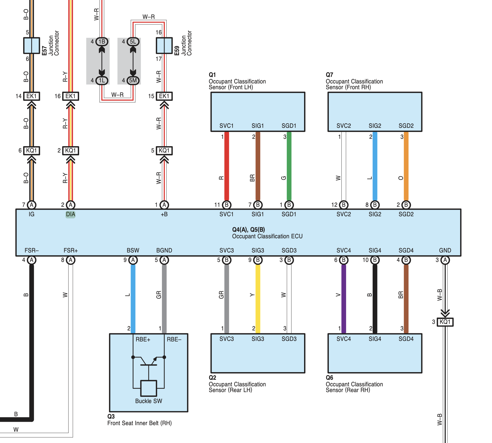
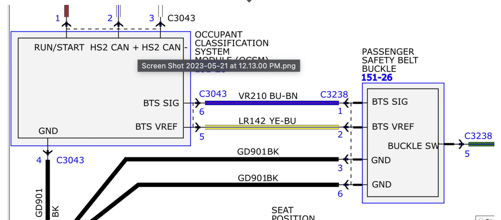
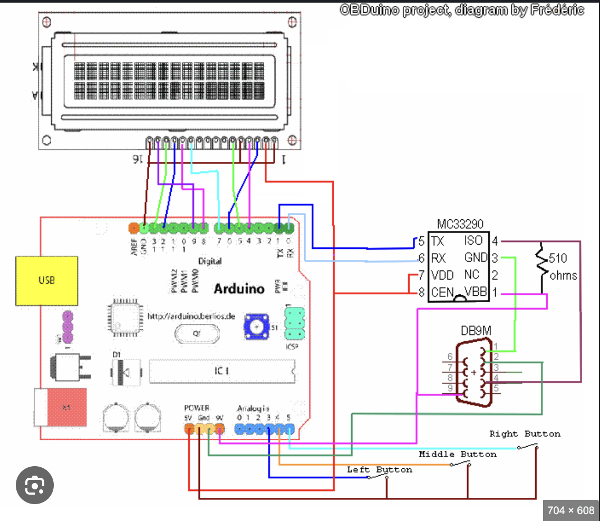

# FjCruiserPassangerAirbagConverter
Converts the output of mustang seats weight sensors to proper output for the FJ so that the seat sensor works 
NOTE: this project is still in developlemt phase.

# Output
The FJ cruiser outputs reads the weight of the passenger using 4 sensors( Occupant classification sensor) at the corners of the seat. We can replicate the input in 2 ways. Option 1 is to replicate the output of the sensors using a potentiometer or resistors. Option 2 is to connect to the k-line (represented as DIA in the diagram below) and replicate the signal coming from both the car and the controller. Option 1 is simpler but requires keeping the origional on board occupancy module. while option 2 requires less pieces but more engineering effort.



# Input

The input for the controller is CAN bus, the canbus coming from the new seats will let us know 3 things, whether we are buckled up, if the weight is a "child" to disable the seatblet chime and the passanger airbags, or if the weight surpasses the 30Kg limit it will disable the chime but keep the passanger airbag on. This will potentially be expanded to control using a button or K-wire input.
If using different seats with canbus output you may use this project to read and log can messages using CanHandler::process, or use [Canable](https://canable.io/) along with [CANgaroo](https://github.com/Schildkroet/CANgaroo) to listen to incoming CAN messages.



# Supported Communications
### K-line
older cars, including the FJ may have a single line for communication between components (see above diagram 'DIA'), this communication is aligned with ISO 9141-2. In order for communications to be established between and arduino (running at 3.3 or 5V) and the car (12-18V) we must use a logic lever shifter. In this case we are using the MC33290 chip alongside with the [OBD9141](https://github.com/iwanders/OBD9141) library



# Hardware
for this project I am using the following hardware. The controller is an ESP32 Feather so it can host the WiFi web UI directly. The board can be changed — fork and modify the env to match, and adjust the GPIO pin map in `src/config.h`.

 - [Adafruit Feather ESP32-S2](https://www.adafruit.com/product/5000)
- [Adafruit CAN Bus FeatherWing](https://www.adafruit.com/product/5709)
- [MC33290](https://www.aliexpress.com/item/1005008723003659.html)


Wiring diagram: Coming soon

# Configuration & Monitoring Interface
The controller runs on an **Adafruit Feather ESP32-S2** (WiFi-only, no Bluetooth) and can be configured and monitored from a phone or laptop over WiFi. The ESP32-S2 runs the converter **and** hosts the web app directly — no separate board or UART bridge:

```
Browser (phone/PC) <--WiFi: HTTP + WebSocket--> Feather ESP32-S2 (converter + web host)
```

The web UI lets you:
- **Monitor** live passenger state (buckled, child/adult), link status, and the log stream
- **Tune** at runtime: enable/disable inputs & outputs, set digital-pot thresholds, force a manual override for bench testing
- **Configure** the active protocol, OCS CAN IDs and custom PIDs, and persist them to the ESP32-S2's flash (NVS)
- **Capture** raw CAN / K-line traffic to reverse-engineer OCS values, and export them straight into [`data/vehicle_protocols.json`](data/vehicle_protocols.json)

Pin assignments stay in firmware (`src/config.h`) and require a reflash — everything else is editable live. See **[docs/web_interface.md](docs/web_interface.md)** for wiring, the JSON protocol, and build/flash steps.

# Running It

Built with [PlatformIO](https://platformio.org/). The firmware hosts the web UI itself, so there's no app to install on your phone — you just flash the board and open a browser.

## Flash the board

Plug the Feather into USB and run:

```bash
make flash
```

This does the whole deploy in one call: compiles + uploads the firmware, gzips the web UI, and writes it to the board's LittleFS filesystem. (First S2 flash may need the bootloader: double-tap RESET, or hold BOOT + tap RESET.)

Other targets: `make build` (compile only), `make upload` (firmware only), `make fs` (web UI only), `make monitor` (serial log), `make clean`. Run `make help` for the full list.

## Connect from your phone (or any browser)

The board always broadcasts its own WiFi access point on boot:

1. Join the WiFi network **`FJ-OCS-Config`** — password **`fjcruiser`**.
2. Open **http://192.168.4.1** in a browser.

That's it — the page loads from the board and streams live data over a WebSocket.

> **Phone tip:** the AP has no internet, so phones often fall back to mobile data and the page "times out." If that happens, turn off mobile data (or tap *"stay connected"* on Android / use Airplane-mode + WiFi on iPhone), and make sure you typed `http://` (not `https://`).

### Optional: put it on your home WiFi

The board runs AP + station at the same time. In the UI, enter your home SSID/password (saved to NVS); the board keeps its own AP **and** joins your network. Find the address it got from `GET /api/info` (`staIp`), or reach it by hostname `fj-ocs`.

### Troubleshooting

- **Page says "Web UI not flashed"** — the firmware is running but the filesystem isn't. Run `make fs`.
- **No `FJ-OCS-Config` network appears / it keeps dropping** — the board may not be running or is rebooting. Watch the log with `make monitor` and press reset; you should see `WebInterface: AP 'FJ-OCS-Config' at 192.168.4.1` and `=== Setup Complete ===`.

# Warning
I Absolutly do not recommend rewiring your seat, this can lead to injury and death. This project if for educationl purposes only.